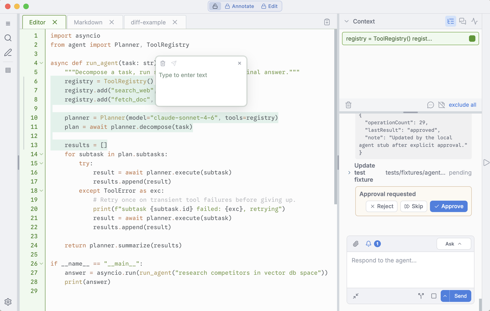

<p align="center">
  
</p>

# Percolate Text Editor

> **Disclaimer**
>
> Percolate is a hobby project, provided as-is. It is not production-ready or security-hardened. The desktop agent and integrated terminal can run local commands with your user account's permissions, and some approval modes execute commands automatically. Use it only with trusted code and in a trusted local environment.
>
> The backend is still under development and has not yet been tested in a live environment.
>

Percolate is an experimental desktop workspace for reading, editing, annotating,
and discussing a local codebase with an AI agent. It combines a file explorer,
code and diff views, terminal, search, chat, and a highlight-based evidence
system in one Electron application.

There are no packaged installers yet. The supported way to try Percolate is to
run the Electron development build from source.



<p align="center"><em>Percolate workspace preview: editing code with highlighted context, inline annotations, agent activity, and human approval controls.</em></p>

## Stack

- Electron for the desktop shell and privileged main process
- SolidJS and TypeScript for the renderer UI
- Vite and electron-vite for development and builds
- CodeMirror 6 for code editing and syntax support
- Vercel AI SDK (`ai`, `@ai-sdk/openai`, and `@ai-sdk/anthropic`) for model streaming and tool calls
- SQLite via `better-sqlite3` for local agent sessions
- `node-pty` and xterm.js for the integrated terminal
- chokidar and ripgrep for workspace watching and search
- Vitest and jsdom for tests

The active desktop application lives in `percolate-text-editor`. Other top-level directories contain earlier experiments and supporting material and are not required to start the current Electron app.

## Prerequisites

- Node.js 22 or newer
- npm (the checked-in lockfile is `package-lock.json`)
- A working native build toolchain for `node-pty` and `better-sqlite3` if prebuilt binaries are unavailable on your platform

On macOS, that usually means installing the Xcode Command Line Tools. Linux and Windows may require their usual C/C++ and Python tooling for Node native addons.

## Run locally

```bash
git clone <repository-url>
cd percolate
npm install
npm run electron:dev:stub
```

`npm install` downloads Electron and rebuilds the native dependencies for the
Electron runtime.

Percolate currently uses the directory from which it is launched as its
workspace. Running the commands above therefore opens this repository. A
polished “open folder” flow is not yet available.

### Development modes

| Command | Purpose |
| --- | --- |
| `npm run electron:dev:stub` | Full Electron UI with deterministic local stub agent responses; no model API key required. |
| `npm run electron:dev:online` | Full Electron UI using the configured OpenAI or Anthropic model. |
| `npm run electron:build` | Compile the Electron main, preload, and renderer output. This does not create an installer. |
| `npm run electron:preview:stub` | Preview the compiled Electron output with the stub agent. Run `electron:build` first. |
| `npm run dev` | Browser-only renderer development. Desktop filesystem, terminal, and native agent bridges are unavailable. |
| `npm test` | Run the Vitest suite once. |

For the most representative experience, use an `electron:*` command rather than the browser-only Vite server.

## Model providers and API keys

Despite the class name `VercelProviderAgent`, Vercel is not a model provider in this application and no Vercel API key is needed. The app uses the open-source Vercel AI SDK to call either OpenAI or Anthropic directly.

Start online mode with an environment variable:

```bash
# OpenAI (the default provider)
OPENAI_API_KEY=your_key npm run electron:dev:online

# Anthropic
ANTHROPIC_API_KEY=your_key npm run electron:dev:online
```

You can also launch online mode, open the app's Settings window, choose OpenAI or Anthropic, set the model name, and choose an API-key file. The file should contain only the raw API token (a trailing newline is fine). Only the Electron main process reads its contents; the sandboxed renderer receives the file path, not the token. The selected path—not the secret itself—is saved in Electron's per-user application-data directory in `agent-settings.json` with user-only file permissions where the platform honors them.

Resolution order is:

1. The API-key file selected in Settings, when present.
2. `OPENAI_API_KEY` or `ANTHROPIC_API_KEY`, according to the selected provider.

Related optional variables are:

- `OPENAI_MODEL` changes the initial OpenAI model; the default is `gpt-4o-mini`.
- `OPENAI_BASE_URL` or `ANTHROPIC_BASE_URL` points the selected provider adapter at a compatible custom endpoint.
- `AGENT_APPROVAL_MODE` sets the initial tool-approval profile.

Provider and model choices are saved locally. Changing providers clears the previously selected key-file path so that a key is not accidentally reused for the wrong provider. Custom base URLs are supported by the backend but are not currently exposed in the Settings UI.

Never commit an API-key file or put a real key in a checked-in `.env` file. This project does not currently load `.env` files itself; variables must be present in the environment that launches Electron.

## Highlights, evidence, and deselection

Selecting at least two characters in an annotatable text or editor view creates a highlight. Highlights from the same source are stored as half-open offset ranges (`[start, end)`). Overlapping selections merge; selecting entirely inside an existing highlight is a no-op. Each highlight becomes an evidence item and can carry a note.

There are several intentionally different ways to act on a highlight:

- Click a highlight to open its note editor.
- Command-click on macOS or Control-click on other platforms to remove that highlight immediately. The registry removes the evidence item and notifies every open view of the same source, so all rendered copies rebuild without it.
- Use the trash button in the evidence strip to remove all currently included evidence items. Excluded items are left alone.
- Toggle a chip in the evidence strip to include or exclude it from the next message. Excluding is not deletion; the highlight remains visible and can be included again.
- After the backend accepts a message, the highlights included in that message are consumed and removed. If sending fails, they remain in place.
- The note editor's delete action goes through the same registry-backed removal path.

Whole-source or container selections use a related `Selectable` mechanism rather than a text range. Deselecting one clears its selected signal, closes and clears its note, and deregisters its evidence item. Bulk teardown uses a callback-free signal reset first to avoid re-entrant deregistration, then explicitly clears the note and context.

The source context registry is the source of truth for ranged highlights. Views render projections of those shared items, which is why removal should go through `sourceContextRegistry.remove(...)` instead of deleting a DOM span directly.

## Local data

Electron stores agent settings, the SQLite session database, undo records, and pending file-edit artifacts under the platform-specific Electron `userData` directory. These files are local and are not intended to be committed. Highlight ranges themselves are currently in-memory UI state and are not reliably persisted across app restarts.

## Project layout

```text
percolate-text-editor/
  electron/          Electron main process, IPC, agent runtime, and tools
  shared/            Protocol and data types shared by main and renderer
  src/               SolidJS renderer, editor, annotations, chat, and panes
  tests/             Vitest unit and interaction tests
  package.json       Development commands and dependencies
```

The renderer runs with context isolation, sandboxing, and Node integration disabled. Filesystem, terminal, search, and agent operations cross a narrow preload/IPC bridge into Electron's main process.

## Current limitations

- No installer, signing, auto-update, or production release pipeline
- No promise of API stability, migrations, backwards compatibility, or support
- No OS-level sandbox around agent tools
- Primarily developed and exercised as a local desktop development build
- Custom endpoints and some backend controls do not yet have complete UI
- Annotation persistence across restarts is unfinished

## License

Percolate Text Editor is licensed under the [BSD 3-Clause License](LICENSE).
